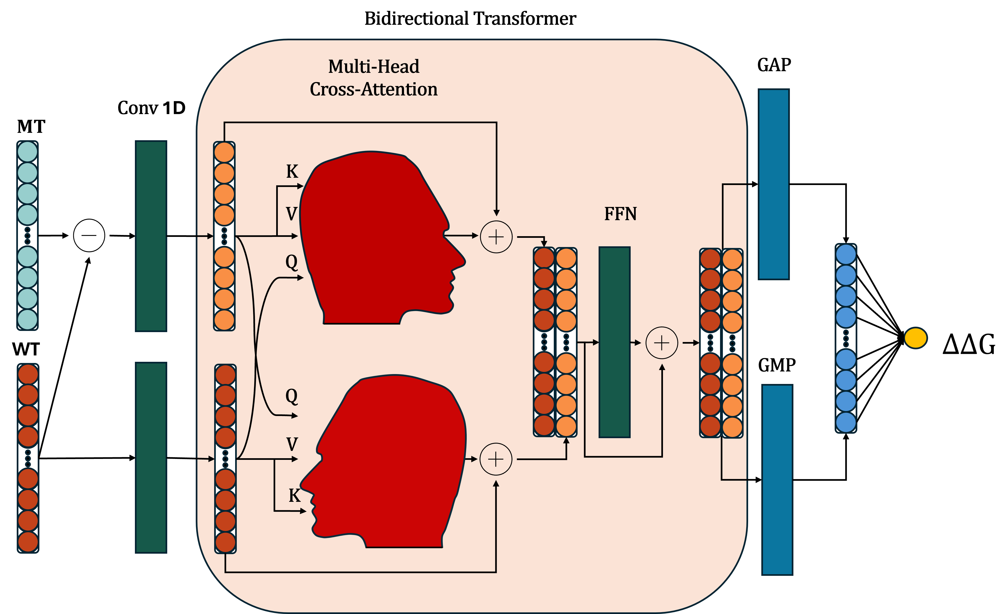

# JanusDDG  




Instructions for using the protein stability prediction tool presented in the paper titled  *JanusDDG: A Thermodynamics-Compliant Model for
Sequence-Based Protein Stability via Two-Fronts Multi-Head
Attention*. [ArXive](https://arxiv.org/pdf/2504.03278)

## Scope of Use

This tool is designed to predict the stability changes of proteins resulting from single or multiple mutations.

## Interpretation of Results

We used the convention where a positive $\Delta\Delta G$ indicates a stabilizing mutation, while a negative value indicates a destabilizing one.

## Prerequisites

- Conda package manager (Miniconda or Anaconda installed).

## Installation

1. Create and activate the Conda environment:
```bash
conda env create -f environment.yml
conda activate janus_env

```

## Usage

To use this tool, you need to create a `.csv` file with the following columns (the column names are mandatory):

- **ID:** Unique identifier for each mutation. Example: `Mut_1` (you can use any unique name for each mutation).
- **Sequence:** Amino acid sequence of the full wild-type protein. Example: `SACGL...`.
- **MTS:** Mutations in the format `<oldAA><POS><newAA>_<oldAA><POS><newAA>_...`.  
  Positions start at 1 for the first amino acid in the sequence.  
  Example: `A30Y_C65G`.
- **DDG:** Experimental ΔΔG values (optional). Example: `-0.5`.


```sh
python src/main.py PATH_FILE_NAME
```


This will generate a new CSV file in the Results folder with the DDG predictions from JanusDDG:
`results/result_FILE_NAME.csv`.

## Example

Run the following command to generate predictions for the s669 dataset.
From the JanusDDG directory:
```sh
python src/main.py data/s669_to_process.csv
```
The "data" directory contains all the datasets used and reported in the paper. By replacing *s669_to_process.csv* with any other dataset present in the same directory, it is possible to reproduce all the other results presented in the paper.


## Training Procedure

We provide a pre-built Docker environment and the complete training dataset.
This setup guarantees that the code runs in the exact software environment (Python 3.11.5, PyTorch CPU version for maximum compatibility) used for the study, resolving any dependency conflicts.

**Prerequisites**

Docker Desktop (or Docker Engine on Linux) installed and running.

**Step-by-Step Guide**

**1. Download the Data (Zenodo)**

Due to size constraints, the training datasets and model checkpoints are hosted on Zenodo.

Download the data archive (janusddg_data.zip) from Zenodo:

**To Add Zenodo link**

Unzip the archive in your current project folder. You should see a folder named train_data (or similar) appear.

**2. Pull the Docker Image**

Download the pre-built environment from Docker Hub. This image contains all necessary libraries and source code.

```sh
docker pull bardu98/janusddg:v1.0
```

**3. Run the Training Container**

Launch the container by mounting your current directory (containing the unzipped data) to the container.

On Linux / WSL / Mac:

```sh
docker run -p 8888:8888 -v "$(pwd):/app" bardu98/janusddg:v1.0
```

On Windows (PowerShell):

```sh
docker run -p 8888:8888 -v "${PWD}:/app" bardu98/janusddg:v1.0
```

**4. Access Jupyter Notebook**

Once the container starts, look at the terminal output. You will see a URL similar to:
http://127.0.0.1:8888/?token=...

Copy and paste this link into your browser to access the Jupyter environment. Open the training notebook and run the cells.

**Note on Hardware & Numerical Precision**

The original results in the paper were obtained using NVIDIA GPUs (CUDA). This Docker container is configured to run on CPU to ensure universal compatibility without driver issues. Due to the inherent non-determinism of floating-point operations between GPU and CPU architectures, the results obtained from this container may show minor numerical deviations compared to the reported figures, but the statistical trends remain consistent.


## How to Cite

If you use this tool in your research, please cite the following paper:

```bibtex
@article{barducci2025janusddg,
  title={JanusDDG: A Thermodynamics-Compliant Model for Sequence-Based Protein Stability via Two-Fronts Multi-Head Attention},
  author={Barducci, Guido and Rossi, Ivan and Codic{\`e}, Francesco and Rollo, Cesare and Repetto, Valeria and Pancotti, Corrado and Iannibelli, Virginia and Sanavia, Tiziana and Fariselli, Piero},
  journal={arXiv preprint arXiv:2504.03278},
  year={2025}
}


